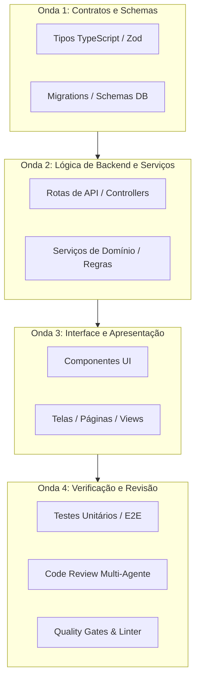

# 🎧 Vibe Coding Toolkit

O fluxo real de desenvolvimento assistido por IA — testado em produção, não em teoria.

Baseado no trabalho de engenharia de software assistida por agentes (Claude Code, Antigravity e Codex), este toolkit transforma a programação com IA de "tentativa e erro" em uma disciplina estruturada e reproduzível.

---

## 💡 Filosofia Central

Programar com IA não é colar um prompt grande e torcer. A sessão principal de um agente sênior segue 5 princípios fundamentais:

1. **Pense antes de codar**: Explore a intenção do pedido, levante premissas e resolva ambiguidades antes de escrever qualquer código.
2. **Simplicidade primeiro**: Menor código que resolve o problema. Sem over-engineering, sem abstrações prematuras para código de uso único, sem configurabilidade desnecessária.
3. **Mudanças cirúrgicas**: Toque apenas no que o pedido exige. Respeite o estilo do projeto existente. Não refatore código adjacente que não faz parte do escopo.
4. **Execução orientada a objetivos verificáveis**: Transforme requisitos em critérios de aceite e testes empíricos.
5. **Orquestrador, não implementador monolítico**: A sessão principal planeja, toma decisões arquiteturais e delega a implementação para subagentes especialistas em ondas paralelas.

---

## ⭐ Os 3 Pilares Fundamentais

### 1. Superpowers (Processo & Planejamento)
O motor do toolkit. Garante que qualquer solicitação complexa passe pelo ciclo:
`Brainstorming` → `Especificação / Plano` → `Implementação em Ondas` → `Revisão Multi-Agente` → `Ship`.
- Nunca assuma requisitos em aberto: se houver mais de uma interpretação razoável, apresente as opções e valide antes de codificar.
- Todo plano divide o trabalho em etapas atômicas com verificação imediata após cada passo.

### 2. Ponytail (Engenheiro Sênior Eficiente & Minimalista)
Governa o que é construído, contendo o vício do agente de criar código a mais:
- *Escada de Decisão*:
  1. Isso realmente precisa existir?
  2. Já existe algo parecido no projeto?
  3. A biblioteca padrão da linguagem (stdlib) ou framework resolve?
  4. Uma dependência já instalada resolve?
  5. Cabe em uma função direta?
  6. Apenas então crie código novo, estritamente no escopo.

### 3. Caveman (Comunicação de Alto Sinal)
Elimina enchimento de linguiça e introduções vazias das respostas do agente:
- Corta frases prolixas ("Vou fazer isso para você!", "Excelente pergunta!").
- Preserva com precisão absoluta: números, unidades, caminhos de arquivo, código, logs e mensagens de erro.

---

## 🌊 Orquestração de Subagentes em Ondas Paralelas

Para tarefas de grande porte, divida a execução em ondas sem conflito de arquivo ou disputa de branch:



### Regras de Isolamento de Subagentes:
- Subagentes em uma mesma onda **nunca editam o mesmo arquivo**.
- Cada subagente recebe um escopo estrito de arquivos de entrada e saída.
- A sessão principal atua como integradora e conferencista das fronteiras.

---

## 🚦 Quality Gates & Burndown

1. **Teto de Linhas por Arquivo**: Máximo de 350 linhas por arquivo. Arquivos maiores devem ser quebrados por responsabilidade (lógica de negócio, UI, acesso a dados), nunca arbitrariamente.
2. **Fronteiras de Arquitetura**:
   - Componentes de UI não fazem queries diretas de banco.
   - Rotas de API validam inputs estritamente com schemas (Zod).
   - Zero tipos `any` soltos.
3. **Burndown de Warnings**: Avisos de linter e TypeScript não são suprimidos com `@ts-ignore` ou `eslint-disable`. Tratam-se como débito técnico a ser zerado.

---

## 🧠 Arquitetura de Memória

- **Memória de Curto Prazo (Sessão)**: Contexto ativo de ferramentas e subagentes.
- **Memória Persistente de Projeto**:
  - `CLAUDE.md` / `AGENTS.md`: Diretrizes e comandos canônicos do repositório.
  - `skills/`: Habilidades e runbooks documentados.
  - `.agents/rules/`: Regras de conduta e padrões estritos.

---

## 📋 Templates Prontos de Prompts

### Template: Brainstorm to Plan
```markdown
Analise a seguinte demanda antes de escrever qualquer código:
[DESCREVA A DEMANDA AQUI]

Execute o protocolo Superpowers:
1. Identifique as ambiguidades e premissas implícitas.
2. Formule as 3 principais perguntas de alinhamento ou opções arquiteturais.
3. Proponha um plano em ondas (Wave 1: Schemas/APIs, Wave 2: Serviços/DB, Wave 3: UI, Wave 4: Testes).
4. Liste os arquivos exatos que serão criados ou modificados.
5. Defina os critérios de verificação empírica para cada etapa.
```

### Template: Multi-Agent Code Review
```markdown
Realize uma revisão multi-agente completa do código alterado:
1. Revisor de Segurança: busque vazamento de dados, injeção, falhas de autorização e rate limiting.
2. Revisor de Arquitetura: verifique separação de camadas, importações cíclicas e acoplamento.
3. Revisor de Performance & Resiliência: avalie renderizações desnecessárias, gargalos de rede e falhas sem fallback.
4. Revisor de UX / Responsividade: verifique quebras de layout mobile (320px-430px), overflow horizontal e touch targets.
```
