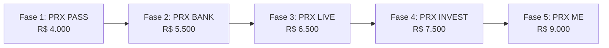

# PROJETO DE ORÇAMENTO TÉCNICO E FINANCEIRO — ECOSSISTEMA PRX

**Documento de Escopo e Investimento por Fases**  
**Versão:** 2.1  
**Referência:** Escopo Funcional do App, Especificação Técnica de Pagamentos e Apresentação Institucional  

---

## 1. Diretrizes Estratégicas do Projeto

O **PRX** é concebido como um ecossistema digital jovem para as Gerações Alpha e Z (*"The Future Pays More / Build. Don't Bet"*), integrando benefícios, banking, eventos presenciais, investimentos e bem-estar em um ambiente único e modular.

### Premissas Técnicas Centrais:
- **Modularidade Total:** Cada fase entrega um módulo funcional independente e escalável, permitindo evolução contínua sem retrabalho.
- **Orquestração de Pagamentos & Split:** Estrutura multi-gateway desacoplada (`PaymentProvider` com suporte a Pagar.me, Mercado Pago e Asaas) com divisão automática de recebíveis entre a plataforma e os parceiros.
- **Integrações Especializadas (BaaS e Corretora):** Front-end proprietário conectado a provedores regulados (BaaS para banco digital e corretora para investimentos), garantindo conformidade com BACEN e CVM.
- **Segurança e Anti-Fraude:** Emissão de vouchers e ingressos via **QR Code dinâmico com rotação de token temporizado** para coibir capturas de tela e reaproveitamento indevido.

---

## 2. Quadro Resumo de Investimento (5 Fases)

| Fase | Módulo / Escopo Principal | Investimento da Fase |
| :---: | :--- | :---: |
| **Fase 1** | **PRX PASS** (Clube de Benefícios, Vouchers QR, Orquestrador de Pagamentos, Split & Painel) | **R$ 4.000,00** |
| **Fase 2** | **PRX BANK** (Banco Digital BaaS, Saldo, Extrato, Pix In/Out, Cartões & Carteira) | **R$ 5.500,00** |
| **Fase 3** | **PRX LIVE** (Eventos, PRX UP Ingressos, PRX RUN Corridas, Validador Portaria & Founders) | **R$ 6.500,00** |
| **Fase 4** | **PRX INVEST** (Plataforma de Investimentos Corretora, Esteira KYC/AML, Suitability & Carteiras) | **R$ 7.500,00** |
| **Fase 5** | **PRX ME** (Saúde Mental, Psicólogos, LGPD Sensível, Mentoria Molina & Conexões Circle) | **R$ 9.000,00** |
| **TOTAL** | **Ecossistema Completo PRX (5 Fases)** | **R$ 32.500,00** |

```
Distribuição Financeira por Fase:
Fase 1 (PRX PASS):    [====] R$ 4.000,00 (12,3%)
Fase 2 (PRX BANK):    [=====] R$ 5.500,00 (16,9%)
Fase 3 (PRX LIVE):    [======] R$ 6.500,00 (20,0%)
Fase 4 (PRX INVEST):  [=======] R$ 7.500,00 (23,1%)
Fase 5 (PRX ME):      [=========] R$ 9.000,00 (27,7%)
                      ------------------------------------
                      TOTAL DO PROJETO: R$ 32.500,00 (100%)
```

---

## 3. Detalhamento do Escopo por Fase



### Fase 1: PRX PASS — Clube de Benefícios & Fundação
**Investimento:** **R$ 4.000,00**

- **Fundação do Aplicativo & Autenticação:**
  - Criação da arquitetura base do app mobile e painel web administrativo.
  - Fluxo de cadastro e autenticação segura (e-mail, senha, login social e verificação OTP).
  - Perfil inicial do usuário com régua básica de pontuação e gamificação (**PRX SCORE**).
- **Marketplace PRX PASS:**
  - Catálogo de parceiros segmentado nas categorias de estilo de vida (Gastronomia, Moda, Viagens, Tecnologia, etc.).
  - Página individual de cada parceiro com logotipo, detalhes da oferta e percentual de benefício.
- **Emissão e Validação de Vouchers:**
  - Geração de voucher com **QR Code dinâmico anti-fraude** (código temporizado de utilização única).
  - Histórico de cupons resgatados e utilizados pelo usuário.
- **Camada de Orquestração de Pagamentos & Split (Base):**
  - Módulo central desacoplado de gateway (`PaymentProvider`).
  - Integração com PSP de partida (ex: Pagar.me ou Mercado Pago) para processar Pix, Cartão e Boleto.
  - Motor de divisão automática (*split payment*) entre plataforma e lojista parceiro.
- **Portal do Parceiro & Validador:**
  - Painel web responsivo onde o lojista parceiro acompanha ofertas e utiliza a câmera para ler e validar o QR Code do cliente no balcão.

---

### Fase 2: PRX BANK — Banco Digital & Experiência BaaS
**Investimento:** **R$ 5.500,00**

- **Conexão BaaS (Banking-as-a-Service):**
  - Integração segura do front-end com APIs de instituição financeira parceira homologada (Doca, Celcoin, Zoop ou similar).
- **Dashboard e Gestão de Conta Digital:**
  - Exibição de saldo em tempo real e extrato financeiro detalhado com filtros por período e tipo de movimentação.
- **Operações Pix Completas:**
  - Envio e recebimento de Pix por chave (CPF/CNPJ, e-mail, telefone, chave aleatória).
  - Pix Copia e Cola e geração de QR Code Pix para cobrança.
  - Leitor de QR Code para pagamentos instantâneos.
- **Gestão de Cartões:**
  - Emissão e visualização de dados de cartão virtual para compras seguras na internet.
  - Controles de segurança: bloqueio e desbloqueio instantâneo do cartão pelo app.
  - Solicitação e acompanhamento de entrega de cartão físico.
- **Carteira Central PRX:**
  - Consolidação na mesma tela: saldo bancário, cupons do PRX PASS e pontos acumulados.

---

### Fase 3: PRX LIVE — Eventos, Ingressos & Corridas
**Investimento:** **R$ 6.500,00**

- **Vitrine de Eventos Presenciais:**
  - Catálogo de eventos do ecossistema (PRX Founders, PRX Session, Ctrl + PRX, PRX Talks, etc.) com detalhes de data, local e lotes de ingressos.
- **PRX UP (Compra de Ingressos):**
  - Fluxo de compra direto no app: seleção de lotes → checkout transparente no orquestrador → confirmação instantânea.
  - Emissão de ingresso digital na carteira do usuário com QR Code individual de acesso.
- **Controle de Portaria & Acesso:**
  - Módulo do organizador para validação rápida de ingressos por leitura de QR Code, prevenção de duplicidade e check-in em tempo real.
- **PRX RUN (Módulo de Corridas de Rua):**
  - Inscrição em etapas de corrida, escolha de modalidade/categoria e seleção de tamanho de kit/camiseta.
  - Termo de responsabilidade digital e voucher QR para retirada física de kits.
  - Consulta pós-evento de tempos, posições e classificação geral.
- **PRX FOUNDERS:**
  - Formulário de submissão de startups e projetos para Rafael Molina, com upload de apresentação/pitch deck e links de vídeo.
  - Esteira de análise com funil de aprovação (*Enviada → Em Análise → Selecionada*).

---

### Fase 4: PRX INVEST — Plataforma de Investimentos
**Investimento:** **R$ 7.500,00**

- **Integração com Corretora Parceira:**
  - Conexão do aplicativo com APIs de corretora regulada pela CVM/BACEN (a custódia permanece com a instituição credenciada).
- **Esteira de Onboarding de Investidor:**
  - Formulário com esteira de KYC avançada e prevenção à lavagem de dinheiro (AML).
  - Questionário de Perfil de Investidor (*Suitability*) para recomendação adequada de produtos.
- **Catálogo de Investimentos Descomplicado:**
  - Vitrine simplificada para jovens: Renda Fixa, Fundos de Investimento proprietários (*Fundo Futuro, Riqueza PRX*) e Ações/ETFs.
- **Área do Investidor:**
  - Visualização de patrimônio investido, histórico de aportes, rentabilidade consolidada e extratos de posição.
  - Integração com as metas financeiras do jovem no aplicativo.

---

### Fase 5: PRX ME — Saúde Emocional, Mentoria & Conexões
**Investimento:** **R$ 9.000,00**

- **PRX ME (Saúde Emocional & Psicologia):**
  - Catálogo de psicólogos e terapeutas credenciados voltados para a Geração Z (*"Cuidar da cabeça também é subir de nível"*).
  - Fluxo de agendamento de consultas com aplicação de benefício exclusivo PRX.
  - **Blindagem LGPD & Dados Sensíveis:** Criptografia ponta a ponta e separação de registros clínicos e histórico de atendimento de saúde.
  - Liquidação financeira da consulta via saldo da conta PRX BANK.
- **PRX LEVEL (Mentoria de Rafael Molina):**
  - Envio de pitch em vídeo vertical de 60 segundos direto pelo app (*"Zero to One"*).
  - Área exclusiva do mentorado: agenda de encontros, biblioteca de materiais, metas de crescimento e acompanhamento de evolução da startup.
- **PRX CIRCLE (Conexões Humanas "Unplug"):**
  - Algoritmo de conexão baseado em intenções, afinidades intelectuais e frases de propósito (*"sem foto inicial"*).
  - Cards de descoberta com ações *"Interessado"* e *"Passo"*.
  - Chat em tempo real após match mútuo com desbloqueio gradual de dados e ferramentas ativas de moderação e denúncia.

---

## 4. Forma de Pagamento por Marcos de Homologação

A contratação e pagamento ocorrem por fase entregue e homologada:

1. **Fase 1 — PRX PASS:** R$ 4.000,00 *(50% no início da fase e 50% na homologação)*
2. **Fase 2 — PRX BANK:** R$ 5.500,00 *(50% no início da fase e 50% na homologação)*
3. **Fase 3 — PRX LIVE:** R$ 6.500,00 *(50% no início da fase e 50% na homologação)*
4. **Fase 4 — PRX INVEST:** R$ 7.500,00 *(50% no início da fase e 50% na homologação)*
5. **Fase 5 — PRX ME:** R$ 9.000,00 *(50% no início da fase e 50% na homologação)*

---

## 5. Resumo das Entregas Técnicas por Fase

| Fase | Nome | Valor | Principais Entregas Técnicas |
| :---: | :--- | :---: | :--- |
| **1** | **PRX PASS** | **R$ 4.000** | Core App, Auth, Marketplace de Benefícios, QR Code dinâmico anti-screenshot, Payment Orchestrator multi-PSP, Split automático e Painel do Parceiro. |
| **2** | **PRX BANK** | **R$ 5.500** | Integração BaaS, Conta Digital, Saldo em tempo real, Extrato, Pix (Chaves/QR/Copia-e-Cola), Cartão Virtual/Físico e Carteira Unificada. |
| **3** | **PRX LIVE** | **R$ 6.500** | Catálogo de Eventos, Compra de Ingressos PRX UP, App de Validação de Portaria, Inscrições e Kits PRX RUN e Funil de Startups PRX FOUNDERS. |
| **4** | **PRX INVEST**| **R$ 7.500** | Conexão com Corretora CVM, Esteira KYC/AML, Questionário de Suitability, Vitrine de Fundos/Renda Fixa/Ações e Posição Patrimonial. |
| **5** | **PRX ME** | **R$ 9.000** | Agendamento de Psicólogos com blindagem LGPD, Mentoria Rafael Molina com Pitch 60s (PRX LEVEL) e Rede Social sem fotos por propósito (PRX CIRCLE). |
| **TOTAL**| **5 FASES** | **R$ 32.500** | **Ecossistema Completo PRX Entregue e Homologado** |
